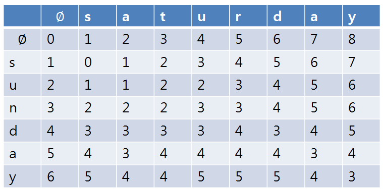
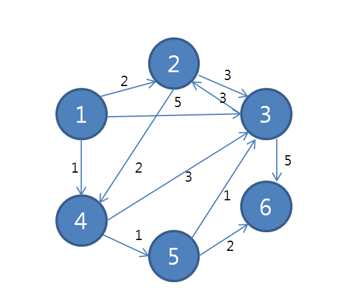
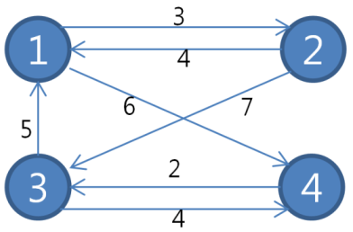

# CodingTest

## 1. 그리디

## 2. 구현

## 3. DFS / BFS
 - 그래프

- DFS소스코드: ([Python 코드](/pystudy/개념/DFS.py))
  - 출력결과: 1, 2, 9, 3, 4, 7, 6, 8, 5

- BFS소스코드: ([Python 코드](/pystudy/개념/BFS.py))
  - 출력결과: 1, 2, 3, 7, 9, 6, 8, 4, 5

## 4. 정렬

## 5. 이진탐색

## 6. 다이나믹 프로그래밍
- 편집 거리 알고리즘: ([Python 코드](/pystudy/개념/편집거리.py))
  - str1 = sunday, str2 = saturday로 가정 교체, 삽입, 삭제 3가지의 연산이 가능하다면  
    두 문자가 같은 경우: 왼쪽 위에 해당하는 수를 그대로 대입.  
    두 문자가 다른 경우: 왼쪽(삽입), 위쪽(삭제), 왼쪽 위(교체)중 최소의 값에 1을 더해 대입.  
  
  

## 7. 최단경로
- 다익스트라 알고리즘: 한 점에서 다른 특정한 점까지의 최단 거리를 구할때 사용 ([Python 코드](/pystudy/개념/dijkstra.py))
  - 출력 결과(시작지점을 1로 설정한 결과) : 0 2 3 1 2 4
  
  
- 플로이드 와샬 알고리즘: 모든 점에서 다른 모든 점까지의 최단 거리를 구할때 사용 ([Python 코드](/pystudy/개념/floyd.py))
  - 출력 결과 [[0, 4, 8, 6], [3, 0, 7, 9], [5, 9, 0, 4], [7, 11, 2, 0]]
  
  
## 8. 그래프 

## 9. 기타 
- bisect를 이용한 이진탐색: ([Python 코드](/pystudy/개념/bisect.py))
